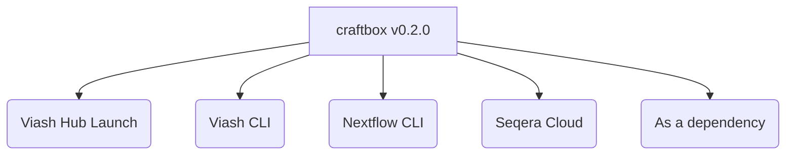
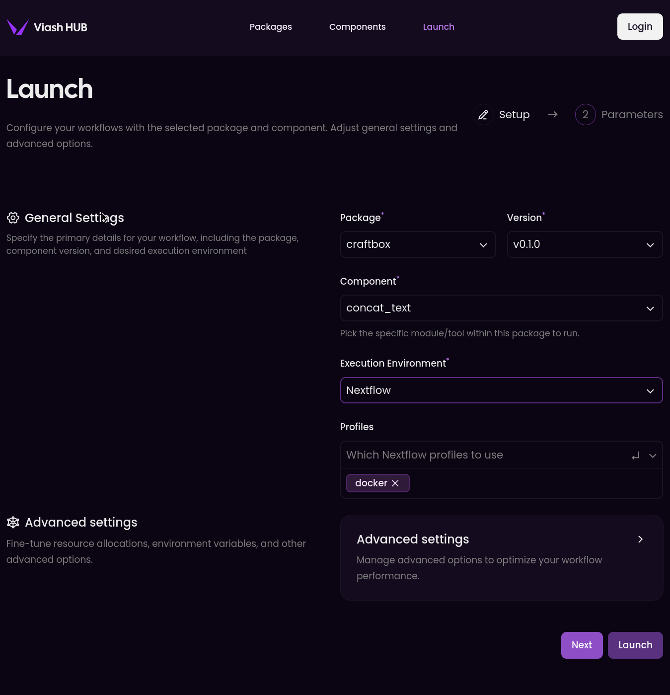

# 🪡📦 craftbox

[](https://www.viash-hub.com/packages/craftbox)
[](https://github.com/viash-hub/craftbox)
[](https://github.com/viash-hub/craftbox/blob/main/LICENSE)
[](https://github.com/viash-hub/craftbox/issues)
[](https://viash.io)

A collection of custom-tailored scripts and applied utilities built with
Viash.

## Introduction

`craftbox` offers a unique set of specialized scripts and tools,
meticulously crafted and packaged using the Viash (https://viash.io)
framework. These components are designed for specific, often custom, use
cases where tailored solutions are paramount.

Emphasizing the Viash principles, `craftbox` components aim for
**reusability**, **reproducibility**, and adherence to **best
practices**. Key features generally include:

- **Standalone & Nextflow Ready:** Components are built to run directly
  via the command line or be smoothly integrated into Nextflow
  workflows.
- **Custom Implementations:** Contains scripts and tools developed for
  particular tasks that may not be found in broader collections.
- **High Quality Standards (promoted by Viash):**
  - Clear documentation for components and their parameters.
  - Full exposure of underlying script/tool arguments for fine-grained
    control.
  - Containerized (Docker) to ensure dependency management and a
    consistent, reproducible runtime environment.
  - Unit tested where applicable to ensure components function as
    expected.

## Example Usage

Viash components in craftbox can be run in various ways:



### 1. Via the Viash Hub Launch interface

You can run this component directly from the Viash Hub [Launch
interface](https://www.viash-hub.com/launch?package=craftbox&version=v0.2.0&component=concat_rtext&runner=Executable).



### 2. Via the Viash CLI

You can run this component directly from the command line using the
Viash CLI.

``` bash
viash run vsh://craftbox@v0.2.0/concat_rtext -- --help

viash run vsh://craftbox@v0.2.0/concat_rtext -- \
  --input path/to/input.txt \
  --input path/to/compressed.txt.gz \
  --output path/to/output.txt
```

This will run the component with the specified input files and output
the results to the specified output file.

### 3. Via the Nextflow CLI or Seqera Cloud

You can run this component as a Nextflow pipeline.

``` bash
nextflow run https://packages.viash-hub.com/vsh/craftbox \
  -revision v0.2.0 \
  -main-script target/nextflow/concat_rtext/main.nf \
  -latest -resume \
  -profile docker \
  --input "path/to/input.txt;path/to/compressed.txt.gz" \
  --output path/to/output.txt
```

**Note:** Make sure that the [Nextflow
SCM](https://www.nextflow.io/docs/latest/git.html#git-configuration) is
set up properly. You can do this by adding the following lines to your
`~/.nextflow/scm` file:

``` groovy
providers.vsh.platform = 'gitlab'
providers.vsh.server = 'https://packages.viash-hub.com'
```

**Tip:** This will also work with Seqera Cloud or other
Nextflow-compatible platforms.

### 4. As a dependency

In your Viash config file (`config.vsh.yaml`), you can add this
component as a dependency:

``` yaml
dependencies:
  - name: concat_rtext
    repository: vsh://craftbox@v0.2.0
```

**Tip:** See the [Viash
documentation](https://viash.io/guide/nextflow_vdsl3/create-a-pipeline.html#pipeline-as-a-component)
for more details on how to use Viash components as a dependency in your
own Nextflow workflows.

## Contributing

Contributions are welcome! We aim to build a comprehensive collection of
high-quality bioinformatics components. If you’d like to contribute,
please follow these general steps:

1.  Find a component to contribute
2.  Add config template
3.  Fill in the metadata
4.  Find a suitable container
5.  Create help file
6.  Create or fetch test data
7.  Add arguments for the input files
8.  Add arguments for the output files
9.  Add arguments for the other arguments
10. Add a Docker engine
11. Write a runner script
12. Create test script
13. Create a `/var/software_versions.txt` file

See the
[CONTRIBUTING](https://github.com/viash-hub/craftbox/blob/main/CONTRIBUTING.md)
file for more details.
